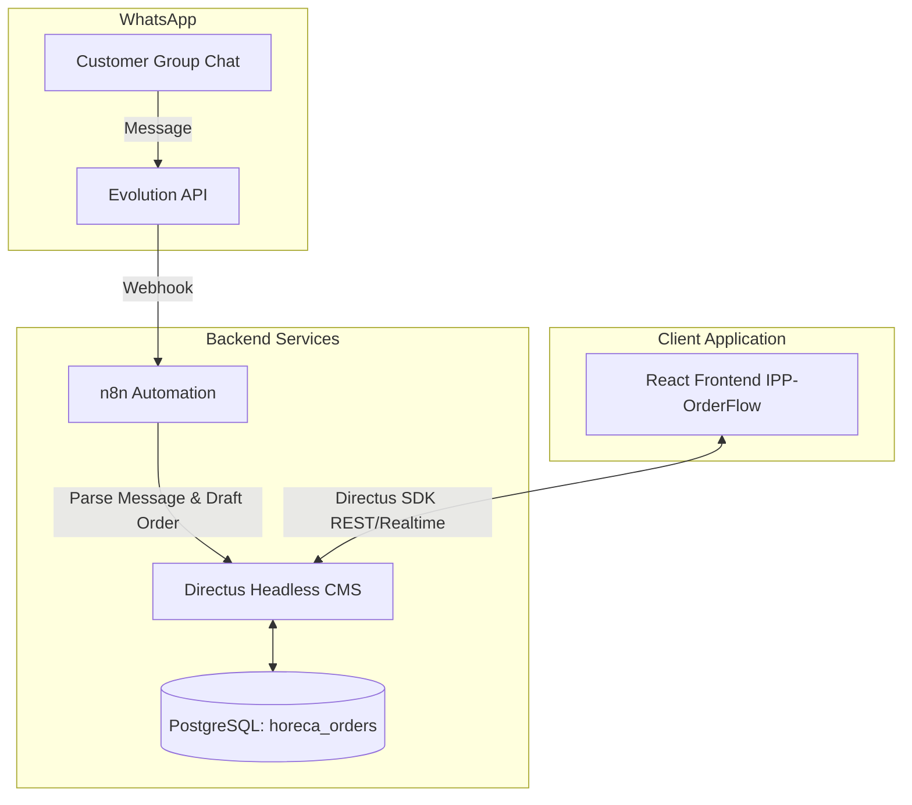

# 📦 IPP-OrderFlow

[](https://react.dev/)
[](https://www.typescriptlang.org/)
[](https://vite.dev/)
[](https://directus.io/)
[](https://www.postgresql.org/)

**IPP-OrderFlow** is a robust, responsive B2B and Horeca order-management application designed for **PT Inti Pangan Perkasa**, a meat and seafood distribution company. 

It streamlines the entire order lifecycle—from automatic WhatsApp message ingestion and draft order parsing to cold-storage weighing, finance approvals, production cutting, document finalization, courier dispatch, and delivery confirmation, including a comprehensive returns sub-flow.

---

## 🚀 Project Context & Phase

We have successfully advanced through the core features of **Phase 1 (App Shell + Admin Dashboard & Directories)**, establishing robust database integration with Directus and completing the manual/automated order intake flows.

### Current Implementation Status
*   **Authentication & Longevity**: Fully integrated email/password authentication using the Directus JSON auth SDK. Access/refresh tokens are stored securely in `localStorage` for tab-persistent sessions, with automatic refresh retry policies on Directus API 401 token expiration.
*   **Multi-Step WhatsApp Intake**:
    1.  **Channel Selection**: Simple modal choosing Horeca (B2B) vs Meatfellas (B2C, disabled for soon).
    2.  **Intake Modal**: A text area to paste WhatsApp groups text messages + attachment input, sending requests to the parsing API.
    3.  **New Order Prefill**: Auto-populates line items, delivery dates, and matched customer fields from parsed API responses, showing confidence status badges (`recognized`, `probable`, `unrecognized`).
*   **Learned Mappings & Corrections**: Manual corrections made by admins during order review (e.g. matching an unrecognized text line to a catalog product) write directly to the `corrections` collection in Directus. Future parses benefit globally from this mapping, training the parsing service.
*   **Customers & Products Directories**:
    *   `/customers` page displays a searchable, paginated registry of accounts. Clickable rows navigate to `/customers/:id`.
    *   `/products` page displays searchable, paginated list of catalog items with category filters. Users with the `manage_products` capability can toggle stock statuses (Active / Out of Stock) inline with optimistic UI updates.
*   **Dossier Detail Pages**:
    *   **Order Detail (`/orders/:id`)**: Renders progressive status stepper, live total calculations, WhatsApp confirmation text builder, printing stylesheet, and notes/history logging.
    *   **Customer Detail (`/customers/:id`)**: Renders customer contact details, live credit limits vs. flight-order exposure figures, and clickable past order records.
    *   **Product Detail (`/products/:id`)**: Edit form for names, catch-weights, categories, and OOS flags, with deletion safety checks.

---

## ⚙️ Tech Stack & Infrastructure

The project fits cleanly inside PT Inti Pangan Perkasa's self-hosted infrastructure (`*.kudafellas.cloud`) without introducing external SaaS dependencies:

*   **Frontend**: React 19, React Router 7, Vite 8, TypeScript 6.
*   **Styling**: Plain CSS with CSS Modules, anchored on design tokens in `src/styles/tokens.css`.
*   **Icons**: CENTRALIZED HugeIcons icon set via `@iconify/react`.
*   **Headless CMS & API Gateway**: Directus 12, serving REST endpoints and managing user roles & ACLs.
*   **Database**: PostgreSQL (`horeca_orders` database) as the single source of truth.
*   **Ingestion Automation**: Evolution API (WhatsApp connection) webhooking payload details into n8n workflows for parsing.

---

## 🛠️ System Architecture

The frontend communicates exclusively with Directus, which handles permissions and synchronizes state across the database.



### Collection Model
The database is structured to support the order lifecycle from intake to delivery:
*   `orders`: Core details (stage, dates, sales rep, customer reference, etc.).
*   `order_lines`: Multi-item orders featuring product codes, required catch weights, and actual weighed figures.
*   `customers` & `products`: The main catalogs synced from core business software (Accurate).
*   `order_history` & `delivery_proofs`: Audit trails and multi-photo delivery records (condition, received state, signed document).

---

## 🔑 Role-Based Access Control (RBAC)

The application supports six distinct operational roles:
1.  **Owner**: Full admin access with capability configurability.
2.  **Admin**: Manages intake, overrides order details, issues invoice printouts.
3.  **Warehouse**: Conducts pull & catch-weight weighing, manages packaging queue.
4.  **Production**: Follows cutting guidelines, marks processes (Cutting ➔ Packing ➔ Ready).
5.  **Finance**: Performs payment checks, approves/rejects orders before production.
6.  **Courier**: Reviews routes, updates coordinates, uploads delivery photos.

All order mutations are verified against a capability matrix defined in the domain layer (`src/lib/domain.ts`) using the `can(role, capability)` wrapper.

---

## 🏃 Getting Started

### Prerequisites
*   Node.js (v18 or higher)
*   Access to a running Directus instance

### Setup Environment
1.  Copy the environment template:
    ```bash
    cp .env.example .env
    ```
2.  Open `.env` and fill in the target endpoints:
    ```env
    VITE_DIRECTUS_URL=https://dev-admin.kudafellas.cloud
    # Keep the static token fallback empty unless debugging specific API states
    VITE_DIRECTUS_TOKEN=
    ```

### Installation
```bash
npm install
```

### Commands
*   **Development Server**: `npm run dev`
*   **Build Project**: `npm run build`
*   **Lint Check**: `npm run lint`

---

## 📐 Development Guidelines

To maintain code quality and project consistency, please adhere to these strict invariants:

> [!IMPORTANT]
> **No Tailwind or CSS-in-JS**: Use plain CSS with CSS Modules. Do not write hardcoded hex values or raw Tailwind classes. Always use CSS variables declared in `src/styles/tokens.css`.

> [!IMPORTANT]
> **Directus is the Single Source of Truth**: The React app must only communicate with the Directus SDK. Never embed custom database or n8n clients in the frontend code.

> [!IMPORTANT]
> **Enforce Capabilities**: All UI triggers or SDK requests that modify orders must pass through the `can()` capability utility check before execution.

> [!NOTE]
> **Track Progress**: Always update `context/progress-tracker.md` and `context/ui-registry.md` after adding or modifying components and flows.