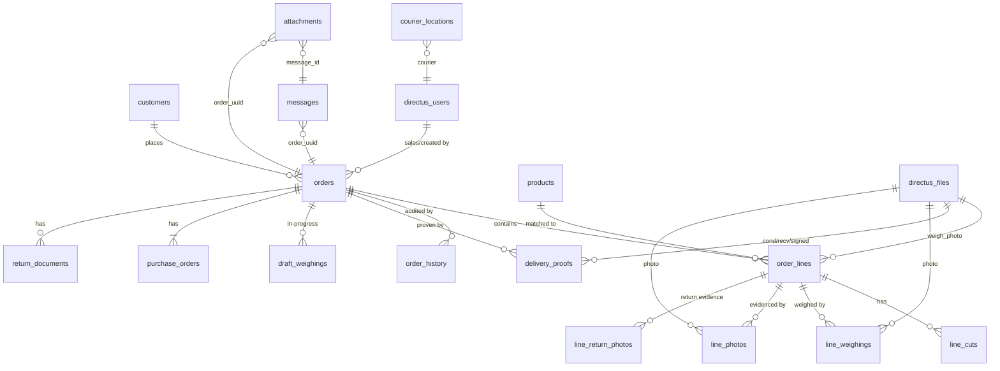

# Architecture Context

## Stack

| Layer       | Technology                         | Role                                                                          |
| ----------- | ---------------------------------- | ----------------------------------------------------------------------------- |
| Frontend    | React 18 + React Router 6 + Vite 5 | Responsive web app (Phase 1), PWA-installable. Ported from the prototype.     |
| Language    | TypeScript                         | Type safety on the frontend (prototype was plain JS).                         |
| UI          | lucide-react + plain CSS           | Icons + styling. No Tailwind. Light/dark theme, EN/Bahasa i18n.               |
| Backend API | Directus 12.0.2 (headless CMS)     | REST/GraphQL API, auth, file storage, role ACLs, realtime. Replaces Firebase. |
| Database    | PostgreSQL (`horeca_orders` db)    | Single source of truth for all business data.                                 |
| Automation  | n8n (+ its own Postgres)           | WhatsApp intake workflow: parses group messages → draft orders in Directus.   |
| WhatsApp    | Evolution API (+ Postgres + Redis) | WhatsApp integration; webhooks → n8n.                                         |
| Files       | Directus Files (`directus_files`)  | Proof photos, attachments — visible across devices.                           |
| Proxy/TLS   | Traefik + Let's Encrypt            | Reverse proxy, auto-HTTPS on `*.kudafellas.cloud`.                            |
| Mobile      | Capacitor 8 (later phase)          | Android APK — NOT in Phase 1, but remains a goal.                             |
| LLM gateway | Hermes (GPT-4o)                    | **On hold** per user — not wired in Phase 1.                                  |

## System Boundaries

- `src/` — React frontend (the app this workspace builds). Owns UI, routing, Directus SDK calls, i18n, theme.
- `context/` — Project documentation (overview, architecture, schema snapshots). Not shipped.
- `.agents/memories/` — Imported session notes + project context. Not shipped.
- **Directus (prod `admin.kudafellas.cloud` / dev `dev-admin.kudafellas.cloud`)** — Owns all business collections, auth, roles, file storage, realtime subscriptions. The frontend talks to this via `@directus/sdk`.
- **n8n** — Owns the WhatsApp intake automation. Reads from Evolution API webhooks, writes draft orders + messages into Directus. The frontend does NOT call n8n directly.
- **Evolution API** — Owns the WhatsApp connection. Sends webhooks to n8n. The frontend does NOT talk to Evolution API.
- **Postgres `horeca_orders`** — The business database Directus sits on top of. Not accessed directly by the frontend (always via Directus).

## Storage Model

- **Postgres `horeca_orders` (via Directus)**: All business data — orders, customers, products, order lines, cuts, weighings, proofs, returns, history, settings. See `context/schema/snapshot.json` for the current intake-only shape and `context/schema/target-db-schema.md` for the full target.
- **Directus Files (`directus_files`)**: Proof photos, WhatsApp attachments, documents. Referenced from `attachments.document_file`, `messages.document_file`, and (in the target schema) from `order_lines.weigh_photo`, `delivery_proofs.*_photo`, `line_weighings.photo_id`, `line_photos.photo_id`, etc. — all as UUID FKs → `directus_files.id`. Replaces the prototype's separate `photos` table + IndexedDB `ipp-photos` store.
- **Directus Users (`directus_users`)**: Team members who log in. Replaces the prototype's `users` table / mock `DEMO_USERS`. Directus roles map to the six business roles.
- **n8n Postgres**: n8n's own execution state. Not business data; not accessed by the frontend.

### Current schema (from snapshot.json — Directus 12.0.2, postgres)

Three collections. **Relations array is empty in the snapshot** even though FK columns exist — relations are declared at the DB column level but not yet registered as Directus M2O relations.

**`orders`** (PK: `id` uuid, default `gen_random_uuid()`)

- `order_id` varchar(50) — human-readable order code
- `status` varchar(50), default `'Draft'` — pipeline stage
- `order_date` date, `delivery_date` date (default `CURRENT_DATE`)
- `sales_rep` varchar(255), `sales_phone_number` varchar(50)
- `customer_name` varchar(255) (indexed), `customer_legal_name` text, `customer_contact` varchar(255), `customer_email` varchar(255), `customer_address` text
- `requested_weight` varchar(255), `actual_weight` varchar(255)
- `order_items` text — **denormalized** (likely JSON blob, not a normalized line-items table)
- `notes` text
- `created_at` timestamptz, `updated_at` timestamp, default `CURRENT_TIMESTAMP`

**`messages`** (PK: `id` int autoincrement; `message_id` varchar(255) unique NOT NULL — WhatsApp message ID)

- `sender_number` varchar(255), `content` text, `caption` text
- `has_attachment` bool default false, `document_file` uuid (→ directus_files, not declared as relation)
- `is_edited` bool default false, `edited_at` timestamptz, `is_deleted` bool default false, `deleted_at` timestamptz
- `quoted_msg_id` varchar(255) — replied-to message
- `ocr_text` text
- `order_uuid` uuid (FK → `orders.id`) — links a message to its parsed order
- `order_id` varchar(50) — denormalized human-readable order code
- `created_at` timestamptz default `CURRENT_TIMESTAMP`

**`attachments`** (PK: `id` int autoincrement)

- `message_id` varchar(255) (FK → `messages.message_id`)
- `order_uuid` uuid (FK → `orders.id`) — direct order link
- `sender_phone` varchar(255)
- `doc_type` varchar(100), `file_path` varchar(500)
- `document_file` uuid (FK → `directus_files.id`) — the actual file
- `caption` text, `ocr_text` text
- `created_at` timestamptz default `CURRENT_TIMESTAMP`

### Schema gaps vs the prototype's needs

The current schema is **intake-focused** (WhatsApp → order draft). It does not yet cover the full pipeline. The target schema below (extracted from the prototype's in-memory shapes in `store.jsx` / `domain.js` / `data/*.js`, normalized into proper collections) is what's needed to go live. Full column-level detail live in `context/schema/target-db-schema.md`; the summary here is the Directus-adapted version.

**Conventions:** `id` = UUID PK (Directus default), timestamps are `TIMESTAMPTZ`, monetary values are `NUMERIC(15,2)` (Rp), weights are `NUMERIC(10,3)` (kg). Directus auto-manages `date_created` / `date_updated` / `user_created` / `user_updated` on every collection, so those are omitted below unless they carry business meaning.

#### Existing collections (intake — keep, extend)

- **`orders`** — extend with the pipeline fields below. Current `status` default `'Draft'` maps to the `intake` stage.
- **`messages`** — keep as-is (WhatsApp intake log). `order_uuid` already links to `orders`.
- **`attachments`** — keep as-is (per-message files). `order_uuid` + `message_id` already link out.

#### New collections (pipeline — to create)

- **`customers`** — replaces denormalized customer fields on `orders`. Fields: `name`, `company_name` (legal entity name — equivalent to the current `orders.customer_legal_name`), `channel` (horeca/retail/b2c), `contact`, `address`, `area`, `sales`, `credit_limit` NUMERIC(15,2), `term_days` INT, `pay_timing` (upfront/cod/terms), `pay_method` (cash/transfer). `orders.customer_id` → `customers.id`.
- **`products`** — the Accurate SKU catalog (auto-synced from Accurate exports). Fields: `name`, `accurate_name` (unique — the recognizer's matching key), `category`, `origin`, `grade`, `brand`, `form`, `pack`, `catch_weight` BOOL, `fixed_pack` BOOL, `ppn` (exempt/included/excluded), `active` BOOL.
- **`order_lines`** — replaces `orders.order_items` text blob. Fields: `order_id` → `orders`, `product_id` → `products` (nullable for free-text), `name` (snapshot), `qty` NUMERIC(12,3), `unit` (kg/gram/pack/pcs/box/ekor/loaf), `weight` NUMERIC(10,3) (actual catch-weight), `price` NUMERIC(15,2) (PO-stated only; NULL = priced in Accurate), `status` (recognized/manual/unmatched), `delivered` INT, `returned` INT, `short` BOOL, `removed` BOOL, `weigh_photo` → `directus_files`, `returned_weigh_photo` → `directus_files`, `sort_order` INT.
- **`line_cuts`** — production cut instructions per line. Fields: `line_id` → `order_lines`, `text` (e.g. "steak cut 2 cm"), `done` BOOL, `sort_order` INT.
- **`line_weighings`** — individual scale readings on a catch-weight line (a loaf may be weighed in pieces). Fields: `line_id` → `order_lines`, `weight` NUMERIC(10,3), `photo_id` → `directus_files`, `created_at`.
- **`line_photos`** — per-item proof/condition photos. Fields: `line_id` → `order_lines`, `photo_id` → `directus_files`, `sort_order` INT.
- **`line_return_photos`** — return-evidence photos per line. Fields: `line_id` → `order_lines`, `photo_id` → `directus_files`, `sort_order` INT.
- **`order_history`** — append-only audit trail (replaces `order.history[]`). Fields: `order_id` → `orders`, `at` TIMESTAMPTZ, `who` (→ `directus_users`), `what` TEXT, `stage` TEXT.
- **`delivery_proofs`** — courier's 3-photo proof set + COD flag (replaces `order.proof` + `order.proofLog[]`). Fields: `order_id` → `orders`, `cond_photo` / `recv_photo` / `signed_photo` → `directus_files`, `cod` BOOL, `name` TEXT, `archived` BOOL.
- **`draft_weighings`** — in-progress warehouse weighings that survive leaving + reopening an order (replaces `order.draftCaps`). Fields: `order_id` → `orders`, `line_id` (no FK — drafts may outlive a line briefly), `weight` NUMERIC(10,3), `photo_id` → `directus_files`, `created_at`.
- **`purchase_orders`** — customer PO attached to an order (photo + ref). One-to-one with `orders`. Fields: `order_id` → `orders`, `photo_id` → `directus_files`, `ref` TEXT.
- **`return_documents`** — signed return DO/SI artifacts. Fields: `order_id` → `orders`, `kind` (signed_doc/signed_draft/note), `photo_id` → `directus_files`.
- **`courier_locations`** — ephemeral live courier GPS (replaces BroadcastChannel `ipp-live-loc`). Upserted per ping. Fields: `courier` (→ `directus_users`), `lat` NUMERIC(9,6), `lng` NUMERIC(9,6), `at` TIMESTAMPTZ. Prefer Directus realtime subscriptions over polling.
- **`role_permissions`** — Owner-configurable per-role capability overrides (replaces `settings.permissions`). Composite PK (`capability`, `role`). Owner is always allowed and not stored here. Absence of a row falls back to the coded default in the domain layer.
- **`settings`** — singleton operational settings (replaces `DEFAULT_SETTINGS`). Fields: `require_photo` BOOL, `tol_below_pct` INT, `tol_above_pct` INT, `dispatch_proof_required` BOOL, `lang` TEXT.

#### `orders` extensions (fields to add to the existing collection)

The current `orders` collection is intake-only. Add the pipeline-tracking fields from the target schema: `no` (unique human order number, e.g. `IPP-2026-0001`), `customer_id` → `customers`, `channel`, `stage` (replaces `status`; enum of the 12 pipeline states), `sales`, `deliver_at`, `delivered_at`, `cancelled` BOOL + `cancelled_from`, `cutting_started` BOOL, `taken_by`, `pickup` BOOL, `third_party` BOOL, `payment_confirmed` BOOL, `return_received` BOOL, `return_settle`, `return_doc`, `return_inbound` BOOL, `is_replacement` BOOL, `partial_return` BOOL, `returned_reason`. The existing denormalized customer fields (`customer_name`, `customer_legal_name`, etc.) become snapshots kept for historical orders; new orders reference `customer_id`.

#### Relations to register in Directus

The snapshot's `relations` array is empty even though FK columns exist at the DB level. Register these as Directus M2O relations so the SDK auto-resolves them:

- `messages.order_uuid` → `orders.id`
- `attachments.message_id` → `messages.message_id`
- `attachments.order_uuid` → `orders.id`
- `attachments.document_file` → `directus_files.id`
- `messages.document_file` → `directus_files.id`
- `orders.customer_id` → `customers.id`
- `order_lines.order_id` → `orders.id`, `order_lines.product_id` → `products.id`, `order_lines.weigh_photo` / `returned_weigh_photo` → `directus_files.id`
- `line_cuts` / `line_weighings` / `line_photos` / `line_return_photos` `.line_id` → `order_lines.id`
- `order_history` / `delivery_proofs` / `draft_weighings` / `purchase_orders` / `return_documents` `.order_id` → `orders.id`
- `courier_locations.courier` → `directus_users.id`

### Key relationships

### Migration notes (prototype → Directus)

- The prototype's `migrate()` step in `store.jsx` becomes Directus schema migrations (applied via the Directus admin UI or CLI). Bump a migration version, never wipe.
- `orderPhotoIds()` in `domain.js` becomes a cascade / cleanup job: when an order is deleted or reset, GC its `directus_files` rows + storage blobs.
- The `can()` resolver stays the single source of truth; it reads `role_permissions` (with coded defaults as the fallback) instead of `settings.permissions`.
- Prices still do **not** live here — they stay in Accurate. `order_lines.price` is only the PO-stated price snapshot, exactly as today.
- The existing `orders` collection's denormalized customer fields are kept as historical snapshots; new orders reference `customer_id`.

## Auth and Access Model

- **Authentication**: Directus auth (email/password, or OAuth). The frontend uses `@directus/sdk`'s `rest()` client with a token. No Firebase, no manual demo login.
- **Users**: Team members live in `directus_users` (Directus's built-in users table). Replaces the prototype's mock `DEMO_USERS` / `seedUsers()`.
- **Roles**: Six business roles — Owner (god mode), Admin, Warehouse, Production, Finance, Courier — mapped to Directus roles. Directus's own `Administrator` / `Public` roles also exist.
- **Ownership**: Every order is created by an Admin (manual) or by n8n (on behalf of a WhatsApp sender). The `sales_rep` / `sales_phone_number` fields track the sales rep, not the DB row owner. Directus's `user_created` / `user_updated` track the actual actor.
- **Access control**: Directus role ACLs (collection-level + field-level permissions). On top of that, the prototype's `CAPABILITIES` matrix (Owner-tunable per role in Settings) gates which pipeline stages and actions each role sees in the UI. The capability matrix is stored in the `role_permissions` collection (with coded defaults as the fallback) and enforced in the frontend domain layer; Directus ACLs enforce it at the API level.

## Invariants

1. **Directus is the only backend the frontend talks to.** The frontend never connects to Postgres, n8n, or Evolution API directly. All reads/writes go through `@directus/sdk`.
2. **Postgres `horeca_orders` is the single source of truth.** No localStorage or IndexedDB as source of truth (the prototype's pattern is dropped). The frontend may cache for offline-tolerance, but Directus wins on conflict.
3. **WhatsApp intake is asynchronous.** Evolution API → n8n → Directus is a one-way pipeline. The frontend polls/subscribes to Directus for new draft orders; it does not wait on n8n.
4. **Every order has a status from the pipeline enum.** Stable keys: `intake → cold → finance → production → finalise → dispatch → delivered` (current UI labels: `New Orders`, `Cold Storage Picking`, `Finance Review`, `Processing`, `Print DO/SI`, `Dispatch`, `Delivered`). Return workflow stages are tracked separately: `awaiting_return`, `admin_action`, `awaiting_signed_doc`, `replacement_transit`. The current schema's default `'Draft'` maps to `intake`.
5. **Proof photos live in Directus Files, not on the device.** Warehouse weigh photos and courier delivery photos are uploaded to `directus_files` and referenced by UUID — visible to every role, every device. Replaces the prototype's separate `photos` table + IndexedDB `ipp-photos` store.
6. **The target schema is normalized.** `order_items` is not a text blob — it's the `order_lines` collection. Customer fields are not denormalized on `orders` — they reference `customers.id`. The existing denormalized fields on `orders` are kept only as historical snapshots.
7. **No destructive filesystem operations outside `IPP-OrderFlow/`.** (Process invariant — see `/memories/destructive-commands.md`.)
