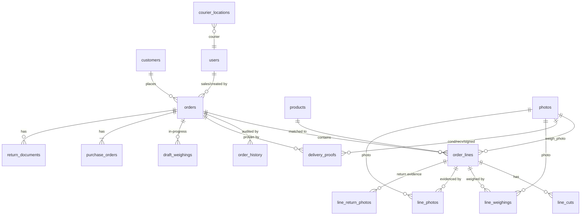

## Target Database Schema (for going live)

The app is currently offline-first with no database. The schema below is the relational model needed to back the same features with multi-user, real-time sync. It mirrors the in-memory shapes in `store.jsx` / `domain.js` / `data/*.js`, normalized into proper tables. Conventions: `id` = UUID PK, timestamps are `TIMESTAMPTZ`, monetary values are `NUMERIC(15,2)` (Rp), weights are `NUMERIC(10,3)` (kg).

### `users`

Team members who can log in. Replaces the mock `DEMO_USERS` / `seedUsers()`.

| Column          | Type                      | Notes                                                                   |
| --------------- | ------------------------- | ----------------------------------------------------------------------- |
| `id`            | UUID PK                   |                                                                         |
| `name`          | TEXT NOT NULL             | e.g. "Teza"                                                             |
| `role`          | TEXT NOT NULL             | enum: `Admin`, `Warehouse`, `Production`, `Finance`, `Courier`, `Owner` |
| `email`         | TEXT UNIQUE               | login identifier (add when real auth lands)                             |
| `password_hash` | TEXT                      | nullable until real auth; store server-side only                        |
| `active`        | BOOLEAN DEFAULT TRUE      | soft-deactivate instead of delete                                       |
| `created_at`    | TIMESTAMPTZ DEFAULT now() |                                                                         |

### `role_permissions`

Owner-configurable per-role capability overrides (replaces `settings.permissions`). The coded defaults in `domain.js` → `ALLOW` seed this table; Owner is always allowed and is **not** stored here.

| Column       | Type    | Notes                                                         |
| ------------ | ------- | ------------------------------------------------------------- |
| `capability` | TEXT PK | one of `CAPABILITIES` keys (e.g. `seePrices`, `createOrders`) |
| `role`       | TEXT PK | enum (excludes `Owner`)                                       |
| `allowed`    | BOOLEAN | override flag; absence falls back to the coded default        |

Composite PK (`capability`, `role`).

### `customers`

Replaces `data/customers.js`. The Horeca account book.

| Column         | Type                           | Notes                                                |
| -------------- | ------------------------------ | ---------------------------------------------------- |
| `id`           | UUID PK                        |                                                      |
| `name`         | TEXT NOT NULL                  |                                                      |
| `channel`      | TEXT NOT NULL DEFAULT 'horeca' | enum: `horeca`, (future: `retail`, `b2c`)            |
| `contact`      | TEXT                           | phone / contact person                               |
| `address`      | TEXT                           |                                                      |
| `area`         | TEXT                           | delivery zone                                        |
| `sales`        | TEXT                           | assigned sales rep name (→ `users.name` once linked) |
| `credit_limit` | NUMERIC(15,2) DEFAULT 0        | Rp; 0 = no limit set                                 |
| `term_days`    | INTEGER DEFAULT 0              | net payment days for "terms" accounts                |
| `pay_timing`   | TEXT                           | enum: `upfront`, `cod`, `terms`                      |
| `pay_method`   | TEXT                           | enum: `cash`, `transfer`                             |
| `created_at`   | TIMESTAMPTZ DEFAULT now()      |                                                      |
| `updated_at`   | TIMESTAMPTZ DEFAULT now()      |                                                      |

`pay_timing` / `pay_method` are the flattened `payment: { timing, method }` object.

### `products`

Replaces `data/products.js` (the Accurate catalog). Auto-synced from Accurate "Item List" exports via `scripts/gen_products.py`.

| Column          | Type                      | Notes                                                         |
| --------------- | ------------------------- | ------------------------------------------------------------- |
| `id`            | UUID PK                   |                                                               |
| `name`          | TEXT NOT NULL             | display name                                                  |
| `accurate_name` | TEXT NOT NULL UNIQUE      | exact Accurate SKU name (the matching key for the recognizer) |
| `category`      | TEXT                      | e.g. "AUSTRALIA BEEF"                                         |
| `origin`        | TEXT                      | e.g. "Australia", "Japan", "USA"                              |
| `grade`         | TEXT                      | e.g. "65 CL", "8-9+"                                          |
| `brand`         | TEXT                      | e.g. "AMG", "CARARA"                                          |
| `form`          | TEXT                      | e.g. "Cut", "Whole"                                           |
| `pack`          | TEXT                      | pack size spec                                                |
| `catch_weight`  | BOOLEAN DEFAULT FALSE     | weighed at delivery (loaf/kg), not counted                    |
| `fixed_pack`    | BOOLEAN DEFAULT FALSE     |                                                               |
| `ppn`           | TEXT                      | enum: `exempt`, `included`, `excluded` (tax treatment)        |
| `active`        | BOOLEAN DEFAULT TRUE      | soft-deactivate old SKUs                                      |
| `created_at`    | TIMESTAMPTZ DEFAULT now() |                                                               |
| `updated_at`    | TIMESTAMPTZ DEFAULT now() |                                                               |

### `orders`

The core pipeline record. Replaces the order objects in `store.jsx` → `seed()`.

| Column              | Type                           | Notes                                                                                                                                               |
| ------------------- | ------------------------------ | --------------------------------------------------------------------------------------------------------------------------------------------------- |
| `id`                | UUID PK                        |                                                                                                                                                     |
| `no`                | TEXT UNIQUE NOT NULL           | human order number (e.g. `IPP-2026-0001`) from `format.js` → `orderNo`                                                                              |
| `customer_id`       | UUID NOT NULL → `customers`    |                                                                                                                                                     |
| `channel`           | TEXT NOT NULL DEFAULT 'horeca' |                                                                                                                                                     |
| `stage`             | TEXT NOT NULL                  | enum: `intake`, `cold`, `finance`, `production`, `packing`, `finalise`, `dispatch`, `delivered`, `outstanding`, `awaiting`, `cancelled`, `returned` |
| `sales`             | TEXT                           | rep name snapshot at creation                                                                                                                       |
| `deliver_at`        | TIMESTAMPTZ                    | scheduled delivery date                                                                                                                             |
| `delivered_at`      | TIMESTAMPTZ                    | actual delivery stamp (replaces `deliveredAt`)                                                                                                      |
| `cancelled`         | BOOLEAN DEFAULT FALSE          |                                                                                                                                                     |
| `cancelled_from`    | TEXT                           | stage it was cancelled from                                                                                                                         |
| `cutting_started`   | BOOLEAN DEFAULT FALSE          | production is actively cutting (freezes cut lines)                                                                                                  |
| `taken_by`          | TEXT                           | courier / 3rd-party who picked it up (replaces `takenBy`)                                                                                           |
| `pickup`            | BOOLEAN DEFAULT FALSE          | customer self-pickup                                                                                                                                |
| `third_party`       | BOOLEAN DEFAULT FALSE          | handed to a 3rd-party service                                                                                                                       |
| `payment_confirmed` | BOOLEAN DEFAULT FALSE          | Finance gate cleared                                                                                                                                |
| `return_received`   | BOOLEAN DEFAULT FALSE          | warehouse confirmed returned goods back in                                                                                                          |
| `return_settle`     | TEXT                           | enum: `sign`, NULL — admin's return-doc state                                                                                                       |
| `return_doc`        | TEXT                           | the Accurate return document reference                                                                                                              |
| `return_inbound`    | BOOLEAN DEFAULT FALSE          | goods still coming back while a replacement runs                                                                                                    |
| `is_replacement`    | BOOLEAN DEFAULT FALSE          | this order is a replacement for a returned one                                                                                                      |
| `partial_return`    | BOOLEAN DEFAULT FALSE          |                                                                                                                                                     |
| `returned_reason`   | TEXT                           |                                                                                                                                                     |
| `created_at`        | TIMESTAMPTZ DEFAULT now()      |                                                                                                                                                     |
| `updated_at`        | TIMESTAMPTZ DEFAULT now()      |                                                                                                                                                     |

### `order_lines`

The items on an order. Replaces `order.lines[]`.

| Column                 | Type                     | Notes                                                    |
| ---------------------- | ------------------------ | -------------------------------------------------------- |
| `id`                   | UUID PK                  |                                                          |
| `order_id`             | UUID NOT NULL → `orders` | CASCADE on order delete                                  |
| `product_id`           | UUID → `products`        | nullable (free-text fallback)                            |
| `name`                 | TEXT NOT NULL            | product name snapshot                                    |
| `qty`                  | NUMERIC(12,3) NOT NULL   | ordered quantity                                         |
| `unit`                 | TEXT NOT NULL            | enum: `kg`, `gram`, `pack`, `pcs`, `box`, `ekor`, `loaf` |
| `weight`               | NUMERIC(10,3)            | actual weighed kg (catch-weight)                         |
| `price`                | NUMERIC(15,2)            | only if the PO stated one; NULL = priced in Accurate     |
| `status`               | TEXT                     | enum: `recognized`, `manual`, `unmatched`                |
| `delivered`            | INTEGER DEFAULT 0        | counted units delivered (for partial / nyusul)           |
| `returned`             | INTEGER DEFAULT 0        | counted units refused                                    |
| `short`                | BOOLEAN DEFAULT FALSE    | flagged short at weigh                                   |
| `removed`              | BOOLEAN DEFAULT FALSE    | line removed from the order (soft)                       |
| `weigh_photo`          | UUID → `photos`          | scale-reading photo                                      |
| `returned_weigh_photo` | UUID → `photos`          | re-weigh on return                                       |
| `sort_order`           | INTEGER DEFAULT 0        |                                                          |

### `line_cuts`

Production cut instructions per line. Replaces `line.cuts[]`.

| Column       | Type                          | Notes                         |
| ------------ | ----------------------------- | ----------------------------- |
| `id`         | UUID PK                       |                               |
| `line_id`    | UUID NOT NULL → `order_lines` | CASCADE on line delete        |
| `text`       | TEXT NOT NULL                 | e.g. "steak cut 2 cm"         |
| `done`       | BOOLEAN DEFAULT FALSE         | ticking done freezes the line |
| `sort_order` | INTEGER DEFAULT 0             |                               |

### `line_weighings`

Each individual scale reading on a catch-weight line (a loaf may be weighed in multiple pieces). Replaces `line.weighings[]`.

| Column       | Type                          | Notes       |
| ------------ | ----------------------------- | ----------- |
| `id`         | UUID PK                       |             |
| `line_id`    | UUID NOT NULL → `order_lines` | CASCADE     |
| `weight`     | NUMERIC(10,3)                 | kg reading  |
| `photo_id`   | UUID → `photos`               | scale photo |
| `created_at` | TIMESTAMPTZ DEFAULT now()     |             |

### `line_photos`

Per-item proof / condition photos (the `line.photos[]` array).

| Column       | Type                          | Notes   |
| ------------ | ----------------------------- | ------- |
| `id`         | UUID PK                       |         |
| `line_id`    | UUID NOT NULL → `order_lines` | CASCADE |
| `photo_id`   | UUID NOT NULL → `photos`      |         |
| `sort_order` | INTEGER DEFAULT 0             |         |

### `line_return_photos`

Return-evidence photos per line. Replaces `line.returnPhotos[]`.

| Column       | Type                          | Notes   |
| ------------ | ----------------------------- | ------- |
| `id`         | UUID PK                       |         |
| `line_id`    | UUID NOT NULL → `order_lines` | CASCADE |
| `photo_id`   | UUID NOT NULL → `photos`      |         |
| `sort_order` | INTEGER DEFAULT 0             |         |

### `order_history`

Append-only audit trail. Replaces `order.history[]`.

| Column     | Type                      | Notes                                                       |
| ---------- | ------------------------- | ----------------------------------------------------------- |
| `id`       | BIGSERIAL PK              |                                                             |
| `order_id` | UUID NOT NULL → `orders`  | CASCADE                                                     |
| `at`       | TIMESTAMPTZ DEFAULT now() |                                                             |
| `who`      | TEXT                      | user name (→ `users.name` once linked)                      |
| `what`     | TEXT NOT NULL             | human description, e.g. "Order created"                     |
| `stage`    | TEXT                      | the stage transitioned to (for delivered/cancelled lookups) |

### `delivery_proofs`

The courier's 3-photo proof set + COD flag. Replaces `order.proof` (`{ cond, recv, signed, cod, name }`). Multiple archived runs live here too (replaces `order.proofLog[]`).

| Column         | Type                      | Notes                                 |
| -------------- | ------------------------- | ------------------------------------- |
| `id`           | UUID PK                   |                                       |
| `order_id`     | UUID NOT NULL → `orders`  |                                       |
| `cond_photo`   | UUID → `photos`           | condition photo                       |
| `recv_photo`   | UUID → `photos`           | receiver photo                        |
| `signed_photo` | UUID → `photos`           | signed DO/SI photo                    |
| `cod`          | BOOLEAN DEFAULT FALSE     | cash on delivery                      |
| `name`         | TEXT                      | receiver name                         |
| `archived`     | BOOLEAN DEFAULT FALSE     | earlier run (true) vs current (false) |
| `created_at`   | TIMESTAMPTZ DEFAULT now() |                                       |

### `draft_weighings`

In-progress warehouse weighings that survive leaving + reopening an order. Replaces `order.draftCaps` (`{ [lineId]: [{ w, photo }] }`).

| Column       | Type                      | Notes                                                                       |
| ------------ | ------------------------- | --------------------------------------------------------------------------- |
| `id`         | UUID PK                   |                                                                             |
| `order_id`   | UUID NOT NULL → `orders`  | CASCADE on order delete                                                     |
| `line_id`    | UUID NOT NULL             | references `order_lines.id` (no FK — draft rows may outlive a line briefly) |
| `weight`     | NUMERIC(10,3)             |                                                                             |
| `photo_id`   | UUID → `photos`           |                                                                             |
| `created_at` | TIMESTAMPTZ DEFAULT now() |                                                                             |

### `purchase_orders`

The customer PO attached to an order (photo + reference). Replaces `order.po`.

| Column       | Type                      | Notes               |
| ------------ | ------------------------- | ------------------- |
| `id`         | UUID PK                   |                     |
| `order_id`   | UUID NOT NULL → `orders`  | CASCADE, one-to-one |
| `photo_id`   | UUID → `photos`           | the PO image        |
| `ref`        | TEXT                      | PO reference number |
| `created_at` | TIMESTAMPTZ DEFAULT now() |                     |

### `return_documents`

Signed return DO/SI artifacts. Replaces `order.returnSignedDoc` / `order.returnSignedDraft` / `order.returnNotePhoto`.

| Column       | Type                      | Notes                                      |
| ------------ | ------------------------- | ------------------------------------------ |
| `id`         | UUID PK                   |                                            |
| `order_id`   | UUID NOT NULL → `orders`  | CASCADE                                    |
| `kind`       | TEXT NOT NULL             | enum: `signed_doc`, `signed_draft`, `note` |
| `photo_id`   | UUID → `photos`           |                                            |
| `created_at` | TIMESTAMPTZ DEFAULT now() |                                            |

### `photos`

Blob storage reference table. The actual blobs move to object storage (S3 / GCS / Supabase Storage); this table holds metadata + the storage key. Replaces the IndexedDB `ipp-photos` store.

| Column        | Type                      | Notes                  |
| ------------- | ------------------------- | ---------------------- |
| `id`          | UUID PK                   |                        |
| `storage_key` | TEXT NOT NULL UNIQUE      | path in object storage |
| `mime`        | TEXT                      | e.g. `image/jpeg`      |
| `size_bytes`  | INTEGER                   |                        |
| `uploaded_by` | UUID → `users`            |                        |
| `created_at`  | TIMESTAMPTZ DEFAULT now() |                        |

### `courier_locations`

Ephemeral live courier GPS. Replaces the BroadcastChannel `ipp-live-loc` relay. One row per courier (upserted on each ping).

| Column    | Type                      | Notes                         |
| --------- | ------------------------- | ----------------------------- |
| `courier` | TEXT PK                   | courier name (→ `users.name`) |
| `lat`     | NUMERIC(9,6) NOT NULL     |                               |
| `lng`     | NUMERIC(9,6) NOT NULL     |                               |
| `at`      | TIMESTAMPTZ DEFAULT now() | last ping time                |

For a realtime backend, prefer a Firebase Realtime DB / Supabase Realtime collection over a SQL row (the `SEAM` markers in `lib/live.js` point to this).

### `settings`

Singleton operational settings. Replaces `DEFAULT_SETTINGS` + the persisted `settings` blob.

| Column                    | Type                      | Notes                                                           |
| ------------------------- | ------------------------- | --------------------------------------------------------------- |
| `id`                      | INT PK DEFAULT 1          | enforced singleton                                              |
| `require_photo`           | BOOLEAN DEFAULT FALSE     | warehouse must attach ≥1 proof photo per item before releasing  |
| `tol_below_pct`           | INTEGER DEFAULT 10        | weighed total may fall below ordered kg by this % before a hint |
| `tol_above_pct`           | INTEGER DEFAULT 10        | same, above                                                     |
| `dispatch_proof_required` | BOOLEAN DEFAULT TRUE      | courier must attach the 3 delivery photos                       |
| `lang`                    | TEXT DEFAULT 'en'         | default UI language                                             |
| `updated_at`              | TIMESTAMPTZ DEFAULT now() |                                                                 |

### Key relationships

### Migration notes (localStorage → DB)

- The `migrate()` step in `store.jsx` becomes DB migrations (e.g. Prisma / Drizzle / Supabase migrations). Bump a migration version, never wipe.
- `orderPhotoIds()` in `domain.js` becomes a cascade / cleanup job: when an order is deleted or reset, GC its `photos` rows + object-storage blobs.
- The `can()` resolver stays the single source of truth; it reads `role_permissions` (with coded defaults as the fallback) instead of `settings.permissions`.
- Prices still do **not** live here — they stay in Accurate. `order_lines.price` is only the PO-stated price snapshot, exactly as today.
